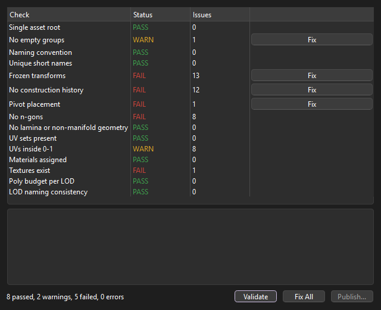
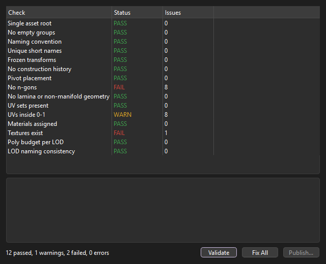
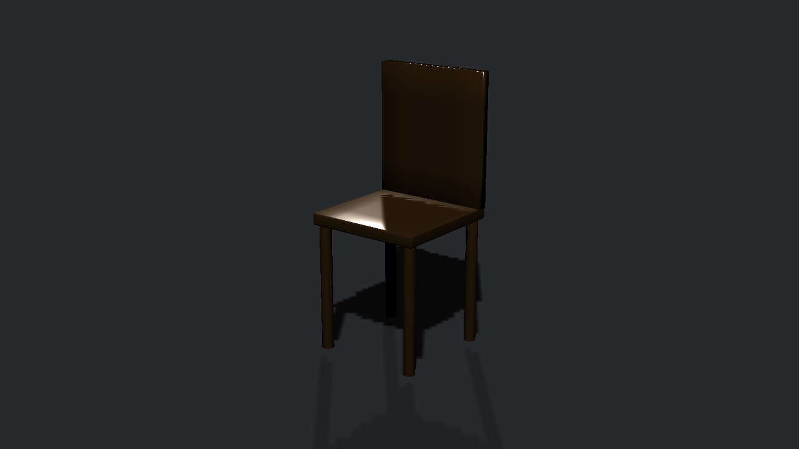

# asset-gate

**This is a work in progress.** It works from start to finish, but I'm
still changing things.

asset-gate checks a Maya asset before you publish it. It fixes what it can.
When nothing is failing, it writes the asset out as USD.

It catches the usual problems: transforms that aren't frozen, leftover
history, n-gons, missing textures, bad names, and LODs that are heavier
than they should be.

I'm using it to rethink tools like [Pyblish](https://pyblish.com). I like
Pyblish's idea of collect, validate, then publish. But in practice the checks
only work inside Maya, the fixes live somewhere else, and whether an asset
is ready depends on which plug-ins ran. So in asset-gate:

- The checks look at a simple description of the asset, not Maya itself.
  That means they can run without Maya, on a farm or in tests.
- If a check can fix its own problem, the fix is part of the check.
- If anything fails, you can't publish.
- What comes out is a real USD asset with LODs, a proxy and materials.



Fix All fixes what it can. Whatever is left needs an artist. Here that's a
missing texture and some n-gons:



When everything passes, Publish writes the USD files. This is the published
chair loaded back into Maya:



## Install

Download or clone the repo and drag `install_asset_gate.py` into the Maya
viewport. It adds an AssetGate button to your shelf and sets Maya up to find
the tool from now on. If your Maya doesn't have PyYAML (2027 doesn't) it gets
installed into the repo's `deps` folder, which needs internet the first time.
Publishing uses the USD that comes with MayaUSD, so that plug-in needs to be
installed (it is by default).

## Using it

Select your asset's top group and click the AssetGate button. Each check
shows PASS, WARN or FAIL with a count; click one to see exactly which nodes
it's complaining about. Fix buttons appear on checks that can fix
themselves. Publish is only enabled once nothing is failing.

The asset should look like this in the Outliner:

```
chair
  geo
    LOD0
      seat_LOD0_GEO
      ...
    LOD1
      seat_LOD1_GEO
      ...
    proxy          (optional)
```

## The checks

| Check | Looks at | Can fix |
|---|---|---|
| Single asset root | one root with a `geo` group and some meshes | |
| No empty groups | groups with no meshes under them | deletes them |
| Naming convention | root, group and mesh names | adds the suffix |
| Unique short names | two nodes with the same name | numbers them |
| Frozen transforms | translate, rotate and scale are zero / one | freezes |
| No construction history | history left on meshes | deletes it |
| Pivot placement | root pivot at the origin or bottom center | moves it |
| No n-gons | faces with more than 4 sides | |
| No lamina or non-manifold geometry | broken topology | |
| UV sets present | every face has UVs | |
| UVs inside 0-1 | UVs outside the 0-1 tile (UDIMs allowed) | |
| Materials assigned | every mesh has a material | |
| Textures exist | texture files are on disk (`<UDIM>` aware) | |
| Poly budget per LOD | triangles per LOD, and each LOD lighter than the last | |
| LOD naming consistency | LODs numbered properly with the same parts | |

Limits like the poly budget and the naming patterns can be changed in a
config file (see `examples/config.yaml`).

## What gets published

For an asset called `chair`:

```
chair.usda     the asset: kind=component, asset info, an "lod" variant set
payload.usda   pulls in geo and mtl
geo.usda       render meshes (one per LOD variant) and a proxy
mtl.usda       UsdPreviewSurface materials with their textures
```

If the asset has no proxy meshes, a bounding box is used as the proxy.

## Outside Maya

The same checks run on a JSON dump of the scene, so a farm job or CI can use
them without Maya:

```
asset-gate validate examples/chair_broken.json
```

```
== asset-gate: chair ===========================================
[PASS] Single asset root
[WARN] No empty groups
        |chair|geo|unused_GRP: group has no meshes
[FAIL] Frozen transforms
        |chair|geo: non-identity translate
[FAIL] No construction history
        |chair|geo|LOD0|seat_LOD0_GEO: history: polyBevel3, polyExtrudeFace
...
== summary =====================================================
7 passed, 2 warnings, 6 failed, 0 errors, 0 fixed
Not publishable.
```

Add `--fix` to apply fixes, and `asset-gate publish chair.json --out
publish/chair/v001` to publish. In Maya, `maya_adapter.dump_scene` writes
that JSON.

## Adding your own check

Put a file like this in a folder and pass the folder with `--plugins` (or set
`ASSET_GATE_PLUGIN_PATH`):

```python
from asset_gate import check


class AssetNameLength(check.BaseCheck):
    id = "studio.name_length"
    label = "Asset name length"
    category = "naming"
    severity = check.WARNING
    defaults = {"max_length": 24}

    def run(self, context):
        limit = self.options(context)["max_length"]
        if len(context.scene.name) > limit:
            return [check.Issue("asset name is too long")]
        return []
```

## Tests

```
pip install -e ".[test]"
pytest             # all the checks, fixes, reports and the USD publish
mayapy -m pytest   # also builds an asset in Maya, fixes it and publishes it
```

## Limits

- Transforms are compared assuming the default rotate order, and pivots and
  shear aren't taken into account. Since the gate wants frozen transforms
  anyway, clean assets aren't affected.
- One material per mesh; per-face material assignments aren't split up.
